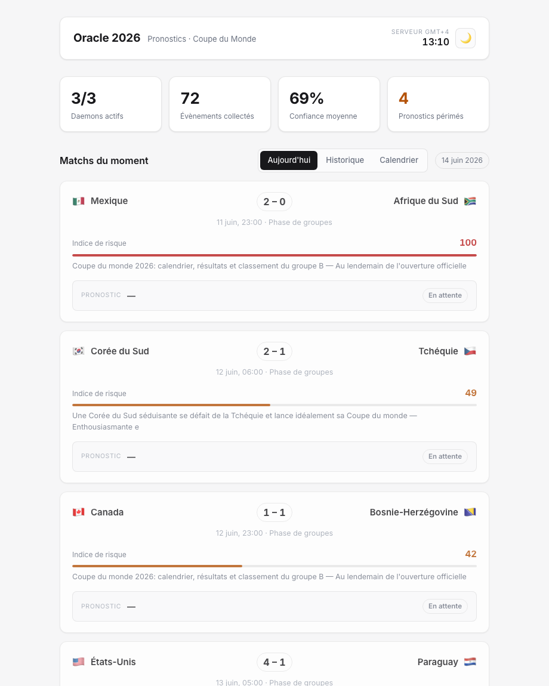
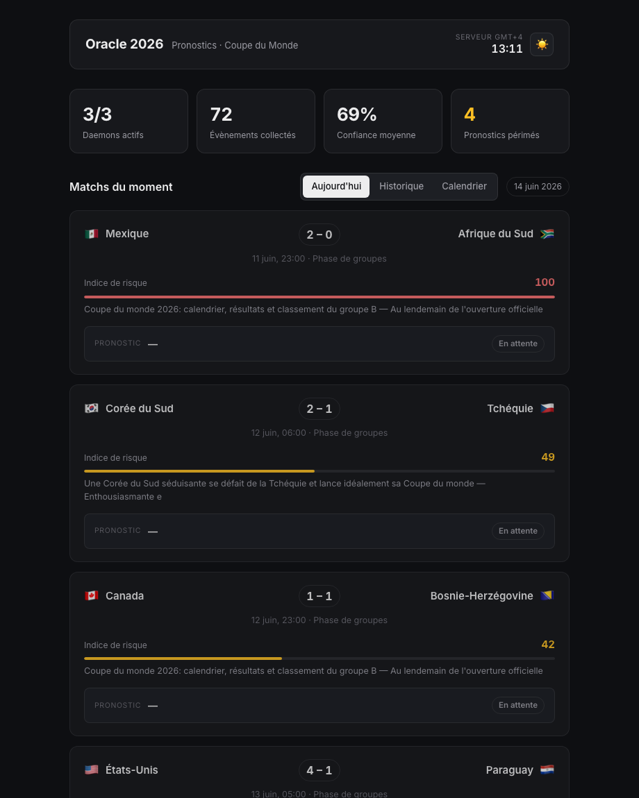

# Oracle 2026 — pronostics Coupe du Monde


[](LICENSE)

Un tableau de bord personnel qui suit la Coupe du Monde 2026 tout seul. Il récupère les matchs et les scores, lit la presse pour repérer ce qui peut faire basculer une rencontre, en tire un indice de risque, puis demande son avis à un modèle d'IA local avant d'afficher le résultat sur une page web sobre. Une fois lancé, il tourne sur un Mac sans qu'on ait à y toucher.

À garder en tête : c'est un projet technique, pas un outil de pari. Les pronostics sont indicatifs.

## Aperçu

Le dashboard, en thème clair et en thème sombre (il suit le système, avec une bascule manuelle) :

<p align="center">
  
  
</p>

Chaque carte montre le score (ou l'heure), l'indice de risque, le pronostic de l'IA avec sa confiance, le signal de pari et la phrase d'explication du modèle.

## Ce que ça fait, concrètement

Toutes les heures, le système :

1. interroge l'API publique d'ESPN pour les matchs du jour (équipes, horaires, scores en direct, statut) ;
2. lit deux flux RSS sportifs français (L'Équipe, RMC Sport) à la recherche de blessures, forfaits, tensions ou polémiques visant une des équipes qui jouent ;
3. rapproche ces articles des bons matchs et les écrit en base ;
4. laisse PostgreSQL recalculer l'indice de risque de chaque match — toute la logique métier vit dans des triggers, pas dans le code Python ;
5. demande à un modèle llama3 tournant en local (via Ollama) un pronostic pour chaque match à venir : issue, score probable, confiance, et une phrase d'explication ;
6. expose le résultat à une page web qui se met à jour seule.

Le modèle ne décide pas dans le vide. On lui donne le classement FIFA réel des deux équipes, on lui désigne le favori (calculé en Python, parce qu'un petit modèle lit mal la convention « 1 = meilleur »), l'indice de risque, et le contexte trouvé dans la presse. On lui interdit aussi d'inventer des faits qui ne sont pas dans ces données.

## L'architecture en une image

```
   ESPN (scores, fixtures)  ─┐
                             ├─► scraper_daemon.py ─► PostgreSQL ─► triggers (indice de risque)
   RSS L'Équipe / RMC ───────┘                          │
                                                         ▼
                                          moteur_ia.py ─► Ollama / llama3
                                                         │
                                                         ▼
                              serveur_api.py (FastAPI) ─► dashboard web
                                     ▲
                              APScheduler relance le cycle toutes les heures
                              launchd garde le serveur en vie 24/7
```

Tout vit dans un seul processus uvicorn : il sert la page, répond à l'API, et héberge le planificateur qui relance l'ingestion et l'IA. `launchd` le lance au démarrage du Mac et le relève s'il tombe.

## La pièce maîtresse : l'indice de risque

Chaque match porte un `indice_risque` entre 0 et 100 (0 = lisible, 100 = très incertain). Il n'est jamais calculé en Python : un trigger PostgreSQL le recalcule à chaque fois qu'un évènement de contexte arrive. Il mélange deux choses — l'écart de niveau entre les deux équipes (tiré du classement FIFA) et la somme pondérée des évènements de presse (une blessure de titulaire pèse lourd, une rumeur peu). Un autre trigger marque automatiquement un pronostic comme périmé si le risque de son match bouge trop après coup.

L'intérêt de mettre ce calcul dans la base et pas dans le code : il s'applique pareil quoi qu'il arrive, qu'on écrive la donnée via le scraper ou qu'on corrige une ligne à la main en SQL. Le détail est dans [`database/schema.sql`](database/schema.sql).

## La pile technique

| Couche | Choix | Pourquoi |
|--------|-------|----------|
| Données match | API publique ESPN | gratuite, sans clé, couvre vraiment la CDM 2026 |
| Contexte presse | flux RSS + `feedparser` | gratuit et illimité |
| Stockage | PostgreSQL 16 | les triggers font le gros du travail métier |
| IA | Ollama + llama3 (8B, local) | aucun coût, aucune donnée qui sort de la machine |
| Serveur | FastAPI + uvicorn | sert l'API et la page sur la même origine |
| Planification | APScheduler (dans le serveur) | pas de cron à gérer |
| Service | `launchd` (macOS) | démarrage auto, relance auto |
| Frontend | HTML + CSS, zéro build | clair/sombre, minimaliste |
| Réglages | `ingestion/config.py` | sources, seuils, cadences au même endroit |

## Structure du dépôt

```
CDM/
├── README.md
├── serveur_api.py                  # FastAPI : page + API + planificateur
├── com.thomas.oracle2026.plist     # service launchd (24/7)
├── requirements.txt
├── .env.example                    # gabarit de configuration
├── database/
│   ├── schema.sql                  # tables + triggers
│   ├── seed_calendrier.py          # 104 slots de matchs de la CDM 2026
│   └── seed_classements.py         # classements FIFA réels + force des équipes
├── ingestion/
│   ├── config.py                   # réglages centralisés (sources, seuils, cadences)
│   ├── scraper_daemon.py           # ESPN + RSS -> PostgreSQL
│   └── moteur_ia.py                # pronostics llama3 via Ollama
├── frontend/
│   ├── index.html                  # dashboard (3 onglets, thème clair/sombre)
│   └── style.css
├── monitoring/                     # configs Nagios/NRPE (cf. note plus bas)
│   ├── commands.cfg
│   └── nrpe.cfg
└── docs/
    └── MONITORING.md
```

## Installation

Il faut PostgreSQL, Python et Ollama sur la machine.

```bash
# 1. Base de données
brew install postgresql@16 && brew services start postgresql@16
createdb oracle2026
psql oracle2026 -f database/schema.sql

# 2. Rôle applicatif (le serveur ne se connecte jamais en superutilisateur)
psql oracle2026 -c "CREATE ROLE scraper LOGIN PASSWORD 'choisis_un_mot_de_passe';
  GRANT USAGE ON SCHEMA public TO scraper;
  GRANT SELECT, INSERT, UPDATE ON ALL TABLES IN SCHEMA public TO scraper;
  GRANT USAGE, SELECT ON ALL SEQUENCES IN SCHEMA public TO scraper;"

# 3. Modèle d'IA local
brew install ollama && brew services start ollama
ollama pull llama3

# 4. Python
python3 -m venv .venv
.venv/bin/pip install -r requirements.txt

# 5. Configuration : copier le gabarit et remplir les accès DB_*
cp .env.example .env   # puis éditer .env

# 6. Données de départ
.venv/bin/python database/seed_calendrier.py    # les 104 matchs (équipes à déterminer)
.venv/bin/python database/seed_classements.py   # classements FIFA réels
```

## Lancement et exploitation

Le service `launchd` fait tout démarrer au login du Mac et relance le serveur s'il s'arrête.

```bash
# Installer le service (le plist contient un chemin placeholder à remplacer
# par le chemin réel du projet — le sed s'en charge)
sed "s#/ABSOLUTE/PATH/TO/CDM#$PWD#g" com.thomas.oracle2026.plist \
  > ~/Library/LaunchAgents/com.thomas.oracle2026.plist
launchctl load ~/Library/LaunchAgents/com.thomas.oracle2026.plist

# Le dashboard est sur http://localhost:8000

# Vérifier que tout tourne
launchctl list | grep oracle2026          # le serveur
brew services list | grep -E 'postgres|ollama'
tail -f logs/server.log                   # logs du serveur + des tâches de fond

# Recharger après une modif du code serveur
launchctl unload ~/Library/LaunchAgents/com.thomas.oracle2026.plist
launchctl load   ~/Library/LaunchAgents/com.thomas.oracle2026.plist
```

Le planificateur relance l'ingestion toutes les 60 minutes et le moteur d'IA toutes les 65 (ces cadences, comme les sources et les seuils, se règlent dans `ingestion/config.py`). L'ingestion tourne jour et nuit : ESPN et le RSS sont gratuits et sans quota. Le moteur d'IA ne pronostique que les matchs à venir qui n'ont pas encore de pronostic valide — c'est la base, via ses triggers, qui décide de ce qui doit être (re)calculé.

Pour accéder au dashboard depuis un téléphone, l'IP locale du Mac suffit sur le même Wi-Fi (`ipconfig getifaddr en0`, puis `http://CETTE-IP:8000`). Pour l'extérieur, un tunnel (ngrok, cloudflared) vers le port 8000.

## Tests

La logique pure (cohérence issue/score d'un pronostic, signal de pari, normalisation des matchs ESPN, rejet des articles RSS génériques, dérivation de force FIFA) est couverte par une suite pytest qui ne touche ni à la base ni au réseau.

```bash
.venv/bin/pip install -r requirements-dev.txt
.venv/bin/python -m pytest tests/ -q
```

Ces tests tournent aussi automatiquement à chaque push via GitHub Actions (`.github/workflows/tests.yml`).

## Ce qu'il faut savoir (limites assumées)

- **Le modèle est modeste.** llama3 8B s'appuie sur le favori FIFA et le contexte de presse, sans finesse tactique. On l'a bridé pour qu'il n'invente pas, mais il ne fait pas de miracle : sur un match sans contexte, il suit le favori et baisse sa confiance.
- **Les classements FIFA sont un instantané.** `seed_classements.py` contient le classement de juin 2026. La FIFA en publie un nouveau tous les deux mois environ — relancer le script pour rafraîchir.
- **Aucune authentification.** Le serveur écoute sur `0.0.0.0` : sur ton réseau, n'importe qui peut voir le dashboard. Acceptable à la maison, à protéger derrière un tunnel à URL privée si tu l'exposes.
- **La supervision Nagios/NRPE est documentée, pas déployée.** Les fichiers de `monitoring/` et `docs/MONITORING.md` décrivent comment surveiller le pipeline en production ; rien ne tourne pour l'instant.

## Pistes pour la suite

- récupérer les classements FIFA automatiquement plutôt qu'à la main ;
- comparer les pronostics aux résultats réels pour mesurer la justesse dans le temps ;
- une vraie suite de tests automatisés ;
- déployer la supervision Nagios si le projet quitte la machine de test.
